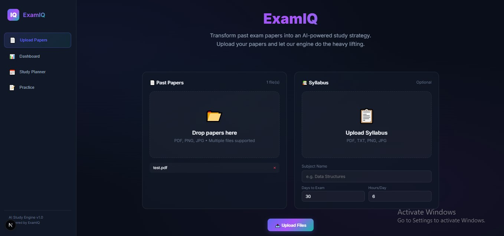
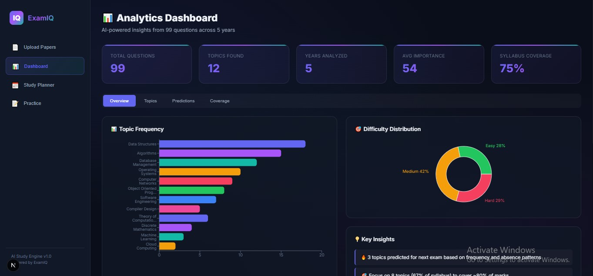
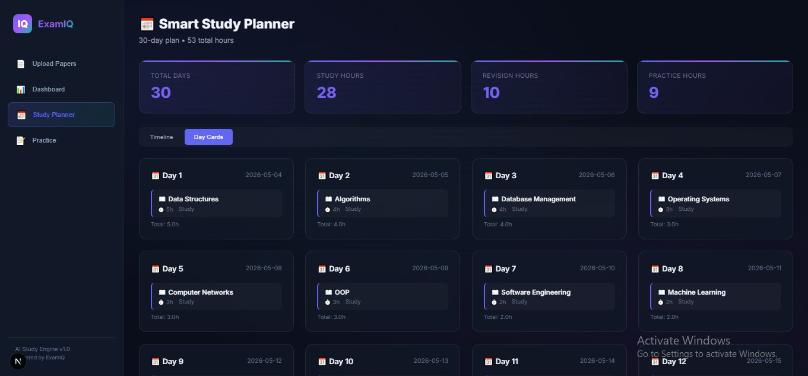
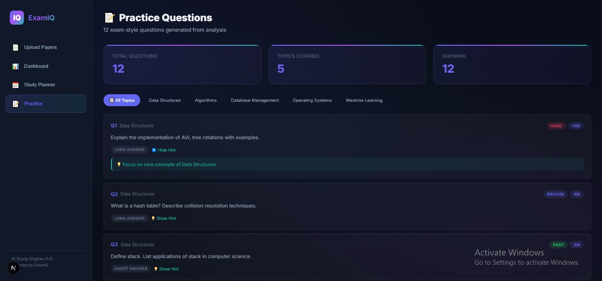

<div align="center">

# 🧠 ExamIQ — AI-Powered Smart Study Strategist

**Transform past exam papers into actionable study intelligence with AI.**

[](https://python.org)
[](https://fastapi.tiangolo.com)
[](https://nextjs.org)
[](https://react.dev)
[](https://huggingface.co/spaces/nitishsaini44/exam-topic-analyzer)
[](LICENSE)

> Upload past exam papers → AI extracts questions, clusters topics, scores importance, predicts what's coming next, and generates a personalized study plan — all in one click.

</div>

---

## 📑 Table of Contents

- [Overview](#-overview)
- [Key Features](#-key-features)
- [Architecture](#-architecture)
- [Tech Stack](#-tech-stack)
- [Project Structure](#-project-structure)
- [Getting Started](#-getting-started)
- [Environment Variables](#-environment-variables)
- [Analysis Pipeline](#-analysis-pipeline)
- [API Reference](#-api-reference)
- [Frontend Pages](#-frontend-pages)
- [Data Models](#-data-models)
- [Smart Scoring Formula](#-smart-scoring-formula)
- [Design System](#-design-system)
- [Screenshots](#-screenshots)
- [Contributing](#-contributing)

---

## 🔭 Overview

**ExamIQ** is a full-stack AI-powered academic decision engine that processes past university/college exam papers to generate predictive study insights. It leverages a **deployed Hugging Face Space** for intelligent topic extraction and runs a multi-step analysis pipeline combining NLP, importance scoring, and predictive intelligence to help students study smarter — not harder.

### The Problem

Students waste hours manually reviewing past papers trying to figure out *what topics are important*. They lack data-driven answers to questions like:

- Which topics appear most frequently?
- What's the trend — is a topic increasing or decreasing in importance?
- Which topics should I focus on for maximum marks with minimum effort (80/20 rule)?
- What topics are likely to appear in the next exam?

### The Solution

ExamIQ automates this entire workflow:

1. **Upload** past exam papers (PDF, DOCX, DOC, TXT, or images)
2. **AI extracts** topics and scores via a deployed HuggingFace Space (Gradio API)
3. **Importance scoring** ranks every topic using a weighted formula
4. **Predictive engine** forecasts next-exam topics and identifies 80/20 focus areas
5. **Study planner** generates a personalized day-by-day schedule
6. **Practice generator** creates exam-style questions for self-assessment

---

## ✨ Key Features

| Feature | Description |
|---|---|
| 🤖 **HuggingFace Space Integration** | Deployed [Exam Topic Analyzer](https://nitishsaini44-exam-topic-analyzer.hf.space) space for AI-powered topic extraction via Gradio Client |
| 🔍 **Hybrid OCR Engine** | PyMuPDF for digital PDFs + Pytesseract fallback for scanned documents |
| 📄 **Multi-Format Support** | PDF, DOCX, DOC, TXT, PNG, JPG, JPEG, BMP, TIFF |
| 📊 **Frequency & Trend Analysis** | Linear regression on year-frequency data for trend detection |
| 🏆 **Smart Importance Scoring** | Weighted formula: `Freq×0.4 + Marks×0.3 + Trend×0.2 + Difficulty×0.1` |
| 🔮 **Predictive Intelligence** | Predicts next-exam topics, 80/20 Pareto strategy, low-ROI detection |
| 📅 **AI Study Planner** | Day-wise schedule with study/revision/practice/buffer phases |
| ✍️ **Practice Generator** | Exam-style questions matching historical patterns |
| 📈 **Visual Dashboard** | Interactive charts, heatmaps, KPI cards, topic rankings |
| 🌙 **Dark Mode UI** | Premium glassmorphism design with smooth animations |
| 📱 **Responsive** | Works on desktop, tablet, and mobile |
| 🚀 **One-Command Launch** | `npm run dev` starts both frontend and backend concurrently |

---

## 🏗️ Architecture

```
┌─────────────────────────────────────────────────────────────┐
│                    FRONTEND (Next.js 16)                    │
│  ┌──────────┐ ┌───────────┐ ┌──────────┐ ┌──────────────┐  │
│  │  Upload   │ │ Dashboard │ │ Planner  │ │   Practice   │  │
│  │   Page    │ │   Page    │ │   Page   │ │     Page     │  │
│  └────┬─────┘ └─────┬─────┘ └────┬─────┘ └──────┬───────┘  │
│       └──────────────┼───────────┼───────────────┘          │
│                      │    API Client (lib/api.js)           │
└──────────────────────┼──────────────────────────────────────┘
                       │ REST API (HTTP)
┌──────────────────────┼──────────────────────────────────────┐
│                  BACKEND (FastAPI)                           │
│  ┌───────────────────┼─────────────────────────────────┐    │
│  │              API Layer (Routers)                     │    │
│  │  /api/upload/*  │  /api/analyze  │  /api/planner    │    │
│  └────────┬────────┴───────┬───────┴────────┬──────────┘    │
│           │                │                │               │
│  ┌────────▼────────────────▼────────────────▼──────────┐    │
│  │              Service Layer (Pipeline)                │    │
│  │  ┌──────────────────┐ ┌────────────┐ ┌───────────┐  │    │
│  │  │  HF Space Topic  │ │  Analyzer  │ │  Scorer   │  │    │
│  │  │  Extractor       │ │  (trends)  │ │ (weights) │  │    │
│  │  │  (Gradio Client) │ └────────────┘ └───────────┘  │    │
│  │  └──────────────────┘                               │    │
│  │  ┌───────────┐ ┌────────────┐ ┌──────────────────┐  │    │
│  │  │ Predictor  │ │  Planner   │ │   Generator      │  │    │
│  │  │(forecasts) │ │ (schedule) │ │   (practice)     │  │    │
│  │  └───────────┘ └────────────┘ └──────────────────┘  │    │
│  └─────────────────────────────────────────────────────┘    │
│           │                                                  │
│  ┌────────▼────────────────────────────────────────────┐    │
│  │              Core Layer                              │    │
│  │  ┌────────────┐  ┌────────────┐  ┌──────────────┐   │    │
│  │  │ OCR Engine  │  │   Config   │  │  Schemas     │   │    │
│  │  │ PyMuPDF +   │  │  .env vars │  │  Pydantic    │   │    │
│  │  │ Tesseract   │  │            │  │  models      │   │    │
│  │  └────────────┘  └────────────┘  └──────────────┘   │    │
│  └─────────────────────────────────────────────────────┘    │
│                              │                               │
│                    ┌─────────▼──────────┐                    │
│                    │  HuggingFace Space │                    │
│                    │  (Gradio API)      │                    │
│                    └────────────────────┘                    │
└─────────────────────────────────────────────────────────────┘
```

---

## 🛠️ Tech Stack

| Layer | Technology | Purpose |
|---|---|---|
| **Frontend** | Next.js 16.2, React 19.2 | SPA with client-side routing |
| **Charts** | Recharts 3.8 | Bar, Pie, Line charts & heatmaps |
| **File Upload** | Native drag-and-drop | Custom drop zone implementation |
| **Backend** | Python FastAPI 0.115 | Async REST API server |
| **OCR** | PyMuPDF 1.24, Pytesseract 0.3 | Text extraction from PDF/images |
| **AI/NLP** | HuggingFace Space (Gradio Client) | Topic extraction & scoring via deployed model |
| **Validation** | Pydantic 2.9 | Request/response schema validation |
| **Image** | Pillow 10.4 | Image processing for OCR |
| **Math** | NumPy 1.26 | Linear regression & normalization |
| **Dev Runner** | concurrently 9.1 | Runs frontend + backend with single command |

---

## 📁 Project Structure

```
ExamIQ/
├── README.md
├── package.json                      # Root: concurrently dev runner
│
├── backend/                          # Python FastAPI Backend
│   ├── .env                          # Environment variables
│   ├── requirements.txt              # Python dependencies
│   ├── uploads/                      # Uploaded files storage
│   │   └── papers/                   #   Exam paper files
│   ├── data/                         # Persisted analysis data
│   │   ├── uploaded_papers.json      #   Registry of uploaded papers
│   │   └── analysis_result.json      #   Cached analysis results
│   │
│   └── app/
│       ├── __init__.py
│       ├── main.py                   # FastAPI app entry point + CORS
│       │
│       ├── api/                      # API Route Handlers
│       │   ├── upload.py             #   POST /api/upload/papers
│       │   ├── analysis.py           #   POST /api/analyze, GET /api/results
│       │   └── planner.py            #   GET /api/planner, /practice, /topics
│       │
│       ├── core/                     # Core Infrastructure
│       │   ├── config.py             #   Environment config & constants
│       │   └── ocr.py                #   Hybrid OCR engine (PyMuPDF + Tesseract)
│       │
│       ├── models/
│       │   └── schemas.py            #   Pydantic data models
│       │
│       └── services/                 # Business Logic (Pipeline)
│           ├── hf_topic_extractor.py #   HuggingFace Space topic extraction
│           ├── analyzer.py           #   Frequency & trend analysis
│           ├── scorer.py             #   Importance scoring
│           ├── predictor.py          #   Predictive intelligence
│           ├── planner.py            #   Study plan generation
│           └── generator.py          #   Practice question generation
│
└── frontend/                         # Next.js Frontend
    ├── package.json
    ├── next.config.mjs
    ├── .env.local                    # API URL config
    │
    ├── public/                       # Static assets
    │
    └── src/
        ├── lib/
        │   └── api.js                # API client (fetch wrappers)
        │
        └── app/
            ├── layout.js             # Root layout + metadata
            ├── page.js               # Main page (SPA router)
            ├── globals.css           # Complete design system
            │
            └── components/
                ├── Sidebar.js        # Navigation sidebar
                ├── UploadPage.js     # File upload + analysis trigger
                ├── DashboardPage.js  # Analytics dashboard with charts
                ├── PlannerPage.js    # Study planner (timeline + cards)
                └── PracticePage.js   # Practice questions with filters
```

---

## 🚀 Getting Started

### Prerequisites

| Requirement | Version | Notes |
|---|---|---|
| **Python** | 3.10+ | Backend runtime |
| **Node.js** | 18+ | Frontend runtime |
| **npm** | 9+ | Package manager |
| **Tesseract OCR** | 5.x | *Optional* — needed only for scanned PDFs |

### 1. Clone the Repository

```bash
git clone https://github.com/nitishsaini-44/examiq.git
cd examiq
```

### 2. Backend Setup

```bash
cd backend

# Create and activate virtual environment
python -m venv venv
# Windows:
venv\Scripts\activate
# macOS/Linux:
source venv/bin/activate

# Install dependencies
pip install -r requirements.txt

# Start the server (standalone)
uvicorn app.main:app --reload --port 8000
```

### 3. Frontend Setup

```bash
cd frontend

# Install dependencies
npm install

# Start development server (standalone)
npm run dev
```

### 4. One-Command Launch (Recommended)

From the **project root**, run both frontend and backend simultaneously:

```bash
# Install root dev dependencies (first time only)
npm install

# Launch both servers concurrently
npm run dev
```

This starts the backend on **http://localhost:8000** (with API docs at `/docs`) and the frontend on **http://localhost:3000**.

### 5. (Optional) Install Tesseract OCR

Tesseract is only required if you plan to upload **scanned** PDF papers (image-based PDFs). Digital/text-based PDFs work without it.

- **Windows**: Download from [UB Mannheim](https://github.com/UB-Mannheim/tesseract/wiki) and install to `C:\Program Files\Tesseract-OCR\`
- **macOS**: `brew install tesseract`
- **Linux**: `sudo apt install tesseract-ocr`

---

## ⚙️ Environment Variables

### Backend (`backend/.env`)

| Variable | Default | Description |
|---|---|---|
| `UPLOAD_DIR` | `./uploads` | Directory for uploaded files |
| `DATA_DIR` | `./data` | Directory for analysis data |
| `TESSERACT_CMD` | `C:\Program Files\Tesseract-OCR\tesseract.exe` | Path to Tesseract binary |
| `HF_SPACE_URL` | `https://nitishsaini44-exam-topic-analyzer.hf.space` | HuggingFace Space URL for topic extraction |
| `CORS_ORIGINS` | `http://localhost:3000,...` | Allowed CORS origins |

### Frontend (`frontend/.env.local`)

| Variable | Default | Description |
|---|---|---|
| `NEXT_PUBLIC_API_URL` | `http://localhost:8000` | Backend API base URL |

---

## 🔬 Analysis Pipeline

ExamIQ processes uploaded papers through a multi-step pipeline executed via `POST /api/analyze`:

### Step 1 — File Upload & OCR

- Papers are uploaded and saved to disk
- Text is extracted using **PyMuPDF** (digital PDFs) with **Pytesseract** fallback (scanned PDFs)
- Supported formats: PDF, DOCX, DOC, TXT, PNG, JPG, JPEG, BMP, TIFF
- Year is auto-detected from filenames (e.g., `exam_2023.pdf`)

### Step 2 — HuggingFace Space Topic Extraction

- Uploaded files (PDF, DOCX, DOC, TXT) are sent to the deployed [Exam Topic Analyzer](https://nitishsaini44-exam-topic-analyzer.hf.space) HuggingFace Space via the **Gradio Client API**
- The Space performs AI-powered analysis: topic identification, frequency counting, and importance scoring
- Returns structured data: topic scores dataframe + detailed analysis markdown
- Results are parsed into `Question` and `TopicAnalysis` objects

### Step 3 — Frequency & Trend Analysis

- Groups questions by topic and computes per-topic statistics
- Calculates **trend** using linear regression on year-frequency data
- Classifies trends as `increasing` (slope > 0.3), `decreasing` (slope < -0.3), or `stable`
- Computes **syllabus coverage**: fully covered / partially covered

### Step 4 — Smart Importance Scoring

Each topic receives a composite importance score (0–100):

```
Score = Frequency × 0.4 + Marks_Weight × 0.3 + Trend × 0.2 + Difficulty × 0.1
```

All components are min-max normalized to [0, 100] before weighting.

**Priority classification:**

| Score Range | Priority |
|---|---|
| >= 75 | 🔴 Critical |
| >= 50 | 🟠 High |
| >= 25 | 🔵 Medium |
| < 25 | ⚪ Low |

### Step 5 — Predictive Intelligence

Generates four types of insights:

| Insight | Logic |
|---|---|
| 🔥 **Predicted Topics** | High frequency + absent in latest exam + not decreasing |
| ⚠️ **Ignored High-Weight** | Importance >= 50 but frequency <= 1 |
| 📉 **Low ROI** | Frequency <= 1, marks <= 5, importance < 25 |
| 🎯 **80/20 Pareto** | Top topics contributing ~80% of total marks |

### Step 6 — Dashboard Data

Builds chart-ready data structures:
- **Frequency bar chart** — top 20 topics by question count
- **Topic × Year heatmap** — matrix of question counts per topic per year
- **Difficulty pie chart** — Easy / Medium / Hard distribution
- **KPI summary** — total questions, topics, years, avg importance, coverage %

### Step 7 — Study Plan Generation

Generates a personalized day-wise schedule based on:
- **Time allocation**: 70% study, 15% revision, 10% practice, 5% buffer
- **Topic priority**: Hours proportional to importance score
- **Session limits**: Max 3-hour sessions per sitting
- **Phase structure**: Study → Revision (top 1/3 topics) → Practice (top 5) → Buffer

### Step 8 — Practice Question Generation

Creates exam-style practice questions:
- Generates 3 questions per high-importance topic (top 10 topics with score >= 25)
- Matches historical question type and difficulty distributions
- Uses template-based generation for 5 question types (Short, Long, MCQ, Numerical, Case-Based)
- Includes study hints for each question

---

## 📡 API Reference

### Upload Endpoints

| Method | Endpoint | Description |
|---|---|---|
| `POST` | `/api/upload/papers` | Upload exam papers (PDF/DOCX/DOC/TXT/PNG/JPG). Accepts `multipart/form-data` with `files` field. |
| `GET` | `/api/upload/status` | Get current upload status (paper count, years, text length). |

### Analysis Endpoints

| Method | Endpoint | Description |
|---|---|---|
| `POST` | `/api/analyze` | Run the full analysis pipeline. Body: `{ exam_days, hours_per_day, subject }` |
| `GET` | `/api/results` | Get latest cached analysis results. |
| `GET` | `/api/dashboard` | Get dashboard chart data (Step 6). |
| `GET` | `/api/predictions` | Get predictive insights (Step 5). |

### Planner Endpoints

| Method | Endpoint | Description |
|---|---|---|
| `GET` | `/api/planner` | Get study plan (Step 7). |
| `GET` | `/api/practice` | Get practice questions (Step 8). |
| `GET` | `/api/topics` | Get ranked topic analysis table. |
| `GET` | `/api/coverage` | Get syllabus coverage report. |

### Utility Endpoints

| Method | Endpoint | Description |
|---|---|---|
| `GET` | `/` | API info (name, version, status). |
| `GET` | `/health` | Health check. |
| `GET` | `/docs` | Interactive Swagger UI documentation. |

---

## 🖥️ Frontend Pages

### 1. Upload Page

- **Drag-and-drop** zone for exam papers (PDF, DOCX, DOC, TXT, PNG, JPG, JPEG)
- **Configuration inputs**: Subject name, Days to exam, Hours per day
- **Two-step flow**: Upload files first → then trigger AI analysis
- **Loading animation** during AI analysis with step descriptions

### 2. Analytics Dashboard

The main analytics view with **4 tabs**:

| Tab | Content |
|---|---|
| **Overview** | Topic frequency bar chart, difficulty pie chart, key insights, topic × year heatmap |
| **Topics** | Ranked table with frequency, marks, trend, importance score, and priority badges |
| **Predictions** | Predicted topics, 80/20 focus list, low-ROI topics |
| **Coverage** | Syllabus coverage progress bar, fully/partially covered topic tags |

**KPI Cards**: Total Questions, Topics Found, Years Analyzed, Avg Importance, Syllabus Coverage

### 3. Study Planner

- **Timeline view**: Scrollable vertical timeline with color-coded session types
- **Day Cards view**: Grid of day cards showing all sessions per day
- **KPI Cards**: Total days, Study hours, Revision hours, Practice hours
- **Color coding**: 📖 Study (blue), 🔄 Revision (purple), ✍️ Practice (teal), ☕ Buffer (gray)

### 4. Practice Page

- **Topic filter**: Pill-style filter buttons to view questions by topic
- **Question cards**: Each showing question number, topic, difficulty badge, marks, and type
- **Expandable hints**: Click "Show Hint" for study guidance
- **KPI Cards**: Total questions, Topics covered, Currently showing

### 5. Sidebar

- Persistent navigation with ExamIQ branding
- 4 nav items: Upload Papers, Dashboard, Study Planner, Practice
- Dashboard/Planner/Practice disabled until analysis data exists
- Responsive: collapses to hamburger menu on tablet/mobile

---

## 📦 Data Models

The backend uses **Pydantic models** for type-safe data flow. Key models:

### Question

| Field | Type | Description |
|---|---|---|
| `id` | string | Unique 8-char UUID |
| `text` | string | Full question text |
| `subject` | string | Subject name |
| `topic` | string | Academic topic (e.g., "Binary Trees") |
| `subtopic` | string | Specific subtopic |
| `question_type` | enum | MCQ, Short Answer, Long Answer, Numerical, Case-Based, Unknown |
| `marks` | float | Marks allocated |
| `difficulty` | enum | Easy, Medium, Hard |
| `year` | int | Exam year |
| `page` | int | Source page number |
| `cluster_id` | int | Cluster assignment |

### TopicAnalysis

| Field | Type | Description |
|---|---|---|
| `topic` | string | Topic name |
| `frequency` | int | Total question count |
| `total_marks` | float | Sum of marks |
| `avg_marks` | float | Average marks per question |
| `years_appeared` | list[int] | Years this topic appeared |
| `trend` | string | increasing / decreasing / stable |
| `trend_score` | float | Linear regression slope |
| `importance_score` | float | Weighted composite score (0-100) |
| `priority` | enum | Critical, High, Medium, Low |
| `rank` | int | Rank by importance |

### AnalysisResult (Full Pipeline Output)

| Field | Type | Description |
|---|---|---|
| `questions` | list[Question] | All extracted questions |
| `topic_rankings` | list[TopicAnalysis] | Ranked topic analysis |
| `syllabus_coverage` | SyllabusCoverage | Coverage breakdown |
| `predictions` | PredictiveInsights | Forecasts & alerts |
| `dashboard_data` | DashboardData | Chart-ready data |
| `study_plan` | StudyPlan | Day-wise schedule |
| `practice_questions` | list[PracticeQuestion] | Generated practice Qs |

---

## 🎯 Smart Scoring Formula

```
Importance Score = (Normalized_Frequency × 0.4)
                 + (Normalized_Marks_Weight × 0.3)
                 + (Normalized_Trend × 0.2)
                 + (Normalized_Difficulty × 0.1)
```

Where:
- **Frequency** = Total question count for the topic
- **Marks Weight** = Total marks contribution
- **Trend** = Linear regression slope of year-frequency data
- **Difficulty** = Weighted sum: `Hard × 3 + Medium × 2 + Easy × 1`

All values are **min-max normalized** to [0, 100] before applying weights.

---

## 🎨 Design System

The frontend uses a custom **dark-mode glassmorphism** design system defined in `globals.css`:

- **Typography**: Inter (UI) + JetBrains Mono (code)
- **Color palette**: Indigo, Purple, Teal, Rose, Amber, Green accents
- **Glassmorphism**: `backdrop-filter: blur()` with translucent cards
- **Animations**: `fadeIn`, `slideUp`, `pulse`, `glow`, `spin`
- **Responsive**: Breakpoints at 1024px (tablet) and 768px (mobile)
- **Custom scrollbar** styling for WebKit browsers

---

## 📸 Screenshots

| Upload Papers | Analytics Dashboard |
|:---:|:---:|
|  |  |

| Smart Study Planner | Practice Questions |
|:---:|:---:|
|  |  |

---

## 🤝 Contributing

1. Fork the repository
2. Create a feature branch: `git checkout -b feature/amazing-feature`
3. Commit your changes: `git commit -m 'Add amazing feature'`
4. Push to the branch: `git push origin feature/amazing-feature`
5. Open a Pull Request

---

<div align="center">

**Built with ❤️ for students who want to study smarter, not harder.**

</div>